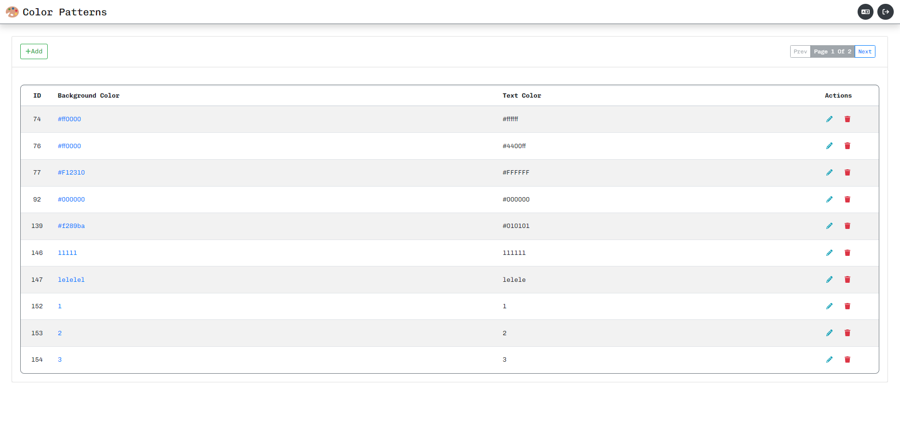

# Crud Color Patterns


> 🎨 Simple CRUD system for color patterns, allowing you to add, edit, show, and delete them.
>
> 
>
> [Leia está página em Portugues](./README_PT-BR.md)

---

## 🧑‍💻 Login Instruction

_When you are on the login page, to access the system you must enter the following values in the e-mail and password fields:_

| Field    | Value                  |
| -------- | ---------------------- |
| E-Mail   | task@searchandstay.com |
| Password | ph37i45K               |

---

## 💻 Technologies

This project uses the following technologies:

- JavaScript e JSON
- [Node e NPM](https://nodejs.org/en/)
- [Vue.js](https://vuejs.org)
- [NuxtJs](https://nuxtjs.org)
- [Boostrap Vue](https://bootstrap-vue.org)
- [Pug.js](https://pugjs.org/api/getting-started.html)
- [SASS](https://sass-lang.com)
- [Fontawesome](https://fontawesome.com)
- [Auth Nuxt](https://auth.nuxtjs.org)
- [I18n Nuxt](https://v8.i18n.nuxtjs.org)

---

## 🔨 Build

To run the project on your machine, perform the following steps:

1. Clone the project on your machine, using a terminal or any other means that makes this possible;

2. Navigate to the project folder and open the terminal inside the project;

3. In the terminal, run the following commands:

   ```cmd
     npm install
   ```

   ```cmd
     npm run dev
   ```

---

## 🖼️ Layout

The layout created for this project in question, it was thought by me with base in acquired past project experiences.

This project contains 3 pages:

- Login;
  

- Overview of all items in Table;
  

- Visualization of specific item in card;
  

---

## 🚀 Deploy

The project is hosted on [GITHUB Pages](https://pages.github.com), To view, [click here!](https://atysonjaime.github.io/crud_color_patterns/)

---

## 📝 License

[MIT License](https://github.com/AtysonJaime/crud_color_patterns/blob/main/LICENSE) © [Atyson Jaime](https://atysonjaime.github.io)
