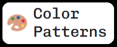

# Crud Color Patterns


> 🎨 Sistema CRUD simples para padronização de cores, permitindo adicionar, editar, mostrar e excluir as mesmas.
>
> 
>
> [Read in English](./README.md)

---

## 🧑‍💻 Instruções para login

_Ao está na página de login, para acessar o sistema você deve colocar os seguintes valores nos campos e-mail e senha:_

| Campo  | Valor                  |
| ------ | ---------------------- |
| E-Mail | task@searchandstay.com |
| Senha  | ph37i45K               |

---

## 💻 Tecnológias

Esse projeto utiliza-se das seguintes tecnologias:

- JavaScript e JSON
- [Node e NPM](https://nodejs.org/en/)
- [Vue.js](https://vuejs.org)
- [NuxtJs](https://nuxtjs.org)
- [Boostrap Vue](https://bootstrap-vue.org)
- [Pug.js](https://pugjs.org/api/getting-started.html)
- [SASS](https://sass-lang.com)
- [Fontawesome](https://fontawesome.com)
- [Auth Nuxt](https://auth.nuxtjs.org)
- [I18n Nuxt](https://v8.i18n.nuxtjs.org)

---

## 🔨 Build

Para rodar o projeto em sua maquina, realize os seguintes passos:

1. Realize o clone do projeto na sua maquina, utilizando o terminal ou qualquer outro meio que possibilite tal processo;

2. Caminhe até a pasta do projeto e abra o terminal dentro do projeto;

3. No terminal realize os seguintes comandos:

   ```cmd
     npm install
   ```

   ```cmd
     npm run dev
   ```

---

## 🖼️ Layout

---

## 🚀 Deploy

---

## 📝 Licença

[MIT License](https://github.com/AtysonJaime/crud_color_patterns/blob/main/LICENSE) © [Atyson Jaime](https://atysonjaime.github.io)
